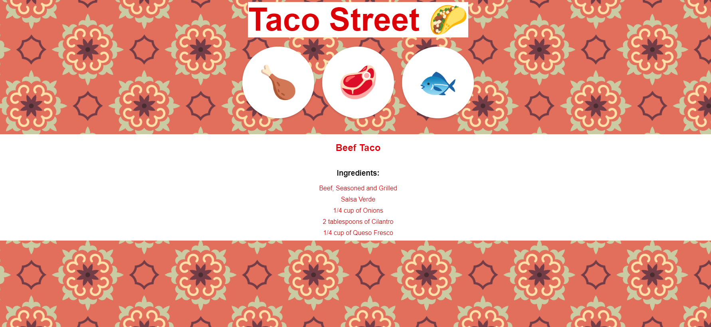

# Taco Street

Taco Street is a web application dedicated to helping taco lovers explore and discover the best taco recipes. Our user-friendly platform provides a diverse range of mouthwatering taco recipes for you to try at home.

## Technologies Used

Taco Street is built using a combination of web technologies to deliver an enjoyable user experience:

- HTML
- CSS
- JavaScript
- Node.js
- EJS (Embedded JavaScript)

## Live Demo

To experience the flavors of Taco Street, check out our live demo [here](#)!

## Getting Started

To set up Taco Street on your local machine for development and testing, follow these steps:

### Prerequisites

Before getting started, ensure that you meet the following requirements:

- Have the latest version of npm and Node.js installed.
- Own a Windows/Linux/Mac machine.

### Installation

1. Clone the repository to your local machine.
2. Install the required dependencies using npm:

   ```bash
   npm install
   ```

3. Start the application:

   ```bash
   node index.js
   ```

4. Open your web browser and navigate to `http://localhost:3000` to access the website.

## Screenshots



## Contributing

We welcome contributions from the taco-loving community! Here's how you can get involved:

1. Fork the repository.
2. Create a new branch for your feature or bug fix:

   ```bash
   git checkout -b feature/your-feature-name
   ```

3. Make changes and commit them:

   ```bash
   git commit -m "Add your commit message here"
   ```

4. Push your changes to your branch:

   ```bash
   git push origin feature/your-feature-name
   ```

5. Create a pull request on the main repository. We appreciate following coding guidelines and maintaining a clean commit history.

## Contact

If you have any questions, suggestions, or just want to chat about tacos, feel free to reach out to us at therahman14@gmail.com. We're excited to hear from you and make Taco Street even more delicious!
